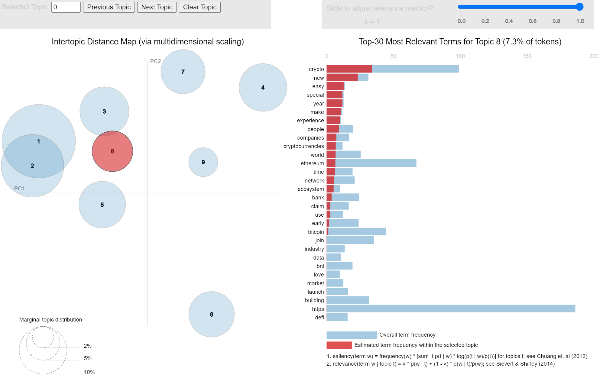
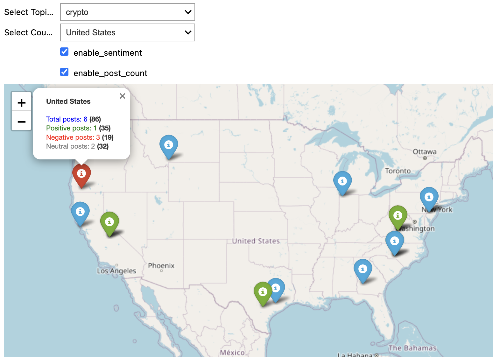

# Summary

SIRITVIS is a powerful text analysis tool that has been carefully designed to analyse data from Reddit, X (Twitter), Instagram, and any external text data sources. It utilises the latest tools to automatically extract information from these sources, clean the data, and optimise topic modeling more efficiently. The Package also contains data visualisation tools to improve the investigation and understanding of textual data. One feature of SIRITVIS is its ability to map social media posts on a global scale, connecting geographical locations with trending topics, thus providing valuable insights into the worldwide trends and conversations shaping our digital landscape. Additionally, it offers sentiment analysis on mapped data using the well-regarded VADER tool [@hutto2014vader]. This software is a valuable resource for the scientific community, offering deep insights into public discussions on various social platforms. It can be used for a wide range of research purposes, including the analysis of recent discussions on global geopolitical issues. Installing SIRITVIS is straightforward, as it can be accomplished using the pip package manager. Comprehensive installation instructions can typically be found in the dedicated repository of the package.^[https://github.com/CodeEagle22/SIRITVIS/]

## Statement of Need

The surge of social media platforms has revolutionised the way we communicate, share information, and express viewpoints on various subjects. Among these platforms, Reddit, Instagram, and X (Twitter) stand out as notable sources of public discourse. Examining text data from these platforms offers valuable insights into public sentiments, preferences, and trending discussions, benefiting fields such as marketing, politics, and disaster management.

Dealing with the colossal volume of unstructured text data from social media is challenging due to its dynamic nature and sheer size. To address this challenge, we introduce SIRITVIS, a text analysis package designed to simplify the analysis of social media data. The package employs advanced neural topic models developed by AVITM [@srivastava2017autoencoding] and other popular topic models, including Latent Dirichlet Allocation (LDA) [@blei2003latent], Neural Latent Dirichlet Allocation (NeuralLDA) [@srivastava2017autoencoding], Product Latent Dirichlet Allocation (ProdLDA) [@srivastava2017autoencoding], and Contextualised Topic Models (CTM) [@bianchi-etal-2021-cross]. These models automatically identify and extract top topics in an unsupervised manner, enabling users to explore large text datasets and discover hidden patterns for meaningful insights.

SIRITVIS encompasses a comprehensive suite of functionalities designed for data extraction from social media platforms, including X (Twitter), Reddit, and Instagram, facilitated through the utilisation of respective application programming interfaces (APIs). This extraction process is followed by a meticulous data preprocessing phase, wherein valuable information is extracted from raw data, and superfluous elements are expunged, utilising advanced natural language processing (NLP) techniques. The resultant processed data is subsequently employed for topic modeling, with the flexibility for users to fine-tune hyperparameters according to their domain expertise.

In addition, the package includes an evaluation module, which allows for the assessment of trained models using a variety of metrics tailored to the user's specific requirements. Furthermore, the software offers the capability to analyse and retrieve the most proficiently trained models, further enhancing its utility and practicality for scientific research and analysis.

To enrich the analysis and comprehension of textual data, SIRITVIS includes two powerful data visualisation tools: PyLDAvis [@sievert_shirley] and Word Cloud [@Mueller_Wordcloud_2023]. The useful data visualisation tool PyLDAvis, created by Sievert and Shirley, improves the interpretation of topic models from textual data. In order to give users a deeper and more intuitive understanding of the latent themes contained in the text corpus, it creates dynamic and interactive visualisations that assist users in exploring the connections between subjects and their associated keywords (see figure 1). On the other hand, the Word Cloud tool offers an engaging and straightforward means of visually representing the most frequently occurring words in the dataset, simplifying the identification of crucial keywords and patterns at a glance (see figure 2). Together, these tools provide users with a comprehensive and user-friendly approach to uncover and communicate the hidden patterns and insights within their textual data.

SIRITVIS is renowned for its remarkable ability to map the spatial distribution of tweets and Instagram posts onto a global map, linking each geographical location with its top trending topics and their respective frequencies (see figure 3). Moreover, it excels in the color-coding of these locations based on the sentiments expressed in each post, providing an accurate count of positive, negative, and neutral posts (see figure 4). Furthermore, SIRITVIS facilitates a user-friendly exploration of specific keywords and visualises their occurrences on the world map. This spatial insight contributes significantly to an enhanced understanding of public discussions and lends invaluable support to data-driven decision-making across diverse domains.

## Comparing and Contrasting Available Toolsets

In recent years, the field of text data analysis from social media has witnessed remarkable advancements, offering researchers and practitioners an array of toolkits and approaches to delve into the wealth of online content. Within this dynamic landscape, it becomes imperative to discern the distinctive features of our research, encapsulated in the SIRITVIS framework, as it stands apart from existing related work.

Although alternatives such as TTLocVis [@Kant2020], TweetViz [@stojanovski2014] and Twitmo [@abuchmueller] have their merits, SIRITVIS sets itself apart by providing exceptional flexibility, usability, and comprehensiveness. Its extensive array of advanced topic models, alongside a distinctive capability for pinpointing geographical information and seamless integration with pyLDAvis [@sievert_shirley] for visualising outcomes, empowers researchers to extract profound insights from social media text data.

What sets SIRITVIS apart is its comprehensive suite of evaluation metrics, facilitated by the octis tool [@terragni2020octis]. These metrics cover important aspects such as topic diversity, accuracy, inverted RBO, coherence, and Jaccard similarity, ensuring that the topic models generated by SIRITVIS are not only reliable, but also imbued with substantive meaning. This robust evaluation framework is a hallmark of the research, emphasizing the toolkit's dedication to producing meaningful results.

Furthermore, SIRITVIS places a strong emphasis on user-friendliness and accessibility. Its intuitive interface and detailed documentation cater to both novice and experienced users, making the toolkit approachable and easy to navigate. Additionally, SIRITVIS is designed to accommodate various data sources and formats, ensuring that researchers can adapt it to their specific research needs effortlessly. This commitment to accessibility broadens the toolkit's reach, making advanced text data analysis more accessible to a wider community of researchers and practitioners.

# Figures

{}

{ }

{  }

{ }

# Acknowledgements

We wish to formally acknowledge and express our gratitude for the substantial contributions of Christoph Weisser and Michael Schlee throughout the entire duration of this project.

# References
