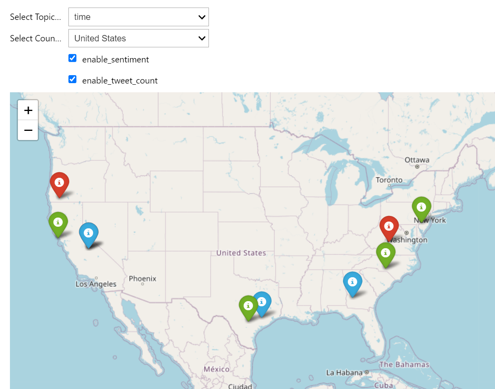

# Summary

SIRITVIS is a powerful text analysis tool that has been carefully designed to analyze data from Reddit, Twitter, Instagram and external text data sources. It utilizes the latest tools to automatically extract information from these sources, clean the data, and optimize topic modeling more efficiently. One standout feature of SIRITVIS is its ability to map social media posts on a global scale, connecting geographical locations with trending topics. Additionally, it offers sentiment analysis on mapped data using the well-regarded NLTK VADER tool. This software is a valuable resource for the scientific community, offering deep insights into public discussions on various social platforms. It can be used for a wide range of research purposes, including the analysis of recent discussions on global geopolitical issues. Installing SIRITVIS is straightforward, as it can be accomplished using the pip package manager. You can find comprehensive installation instructions in the package's dedicated repository ^[https://github.com/CodeEagle22/SIRITVIS/].

## Introduction

The rise of social media platforms has transformed the way we communicate, share information, and express opinions on various topics. Among these platforms, Reddit, Instagram and Twitter stand out as significant sources of public discussion. Analyzing text data from these platforms can provide valuable insights into public sentiments, preferences, and trending discussions, benefiting fields such as marketing, politics, and disaster management.

Dealing with the massive volume of unstructured text data from social media is challenging due to its dynamic nature and sheer size. To tackle this challenge, we introduce SIRITVIS, a text analysis package designed to simplify the analysis of social media data. The package utilizes advanced neural topic models developed by AVITM [@srivastava2017autoencoding] and other popular topic models, including Latent Dirichlet Allocation (LDA), Neural Latent Dirichlet Allocation (NeuralLDA), Prod Latent Dirichlet Allocation (ProdLDA), and Contextualized Topic Models (CTM). These models automatically identify and extract top topics in an unsupervised manner, enabling users to explore large text datasets and discover hidden patterns for meaningful insights.

SIRITVIS offers a range of features to streamline the entire data preparation process, from data collection to model evaluation. Users can easily collect Reddit, Instagram and Twitter posts from around the world using developer accounts. The package includes efficient data cleaning, transformation, training, and evaluation functionalities, ensuring that the data is well-prepared for topic model analysis. To handle sparse social media data, SIRITVIS employs hashtag pooling, a technique that improves result quality.

One noteworthy feature of SIRITVIS is its ability to map the spatial distribution of Tweets and Instagram posts on a world map, associating each location with its top trending topics and their frequency. Additionally, it classifies and color-codes locations based on the sentiments expressed in each posts, providing counts of positive, negative, and neutral posts. Users can also easily explore specific keywords and visualize their occurrences on the world map. This spatial insight enhances our understanding of public discussions and supports data-driven decision-making across various domains.

## Comparing and Contrasting Available Toolsets

In recent years, the field of text data analysis from social media has witnessed remarkable
advancements, offering researchers and practitioners an array of toolkits and approaches to delve
into the wealth of online content. Within this dynamic landscape, it becomes imperative to discern
the distinctive features of our research, encapsulated in the SIRITVIS framework, as it stands apart
from existing related work.

Although alternatives such as TTLocVis [@Kant2020] and TweetViz [@stojanovski2014]
have their merits, SIRITVIS sets itself apart by providing exceptional flexibility and comprehen-
siveness. Its extensive array of advanced topic models, alongside a distinctive capability for pin-
pointing geographical information and seamless integration with "pyLDAvis" for visual-
izing outcomes, empowers researchers to extract profound insights from social media text data.

What truly sets SIRITVIS apart is its comprehensive suite of evaluation metrics, facilitated
by the octis tool [@terragni2020octis]. These metrics cover critical aspects such as topic diversity,
accuracy, inverted RBO, coherence, and Jaccard similarity, ensuring that the topic models generated
by SIRITVIS are not only reliable but also imbued with substantive meaning. This robust evaluation
framework serves as a hallmark of the research, emphasizing the toolkit’s dedication to producing
meaningful results.

Furthermore, SIRITVIS places a strong emphasis on user-friendliness and accessibility. Its
intuitive interface and detailed documentation cater to both novice and experienced users, making
the toolkit approachable and easy to navigate. Additionally, SIRITVIS is designed to accommodate
various data sources and formats, ensuring that researchers can adapt it to their specific research
needs effortlessly. This commitment to accessibility broadens the toolkit’s reach, making advanced
text data analysis more accessible to a wider community of researchers and practitioners.

# Figures

{ width=80% }

# References
