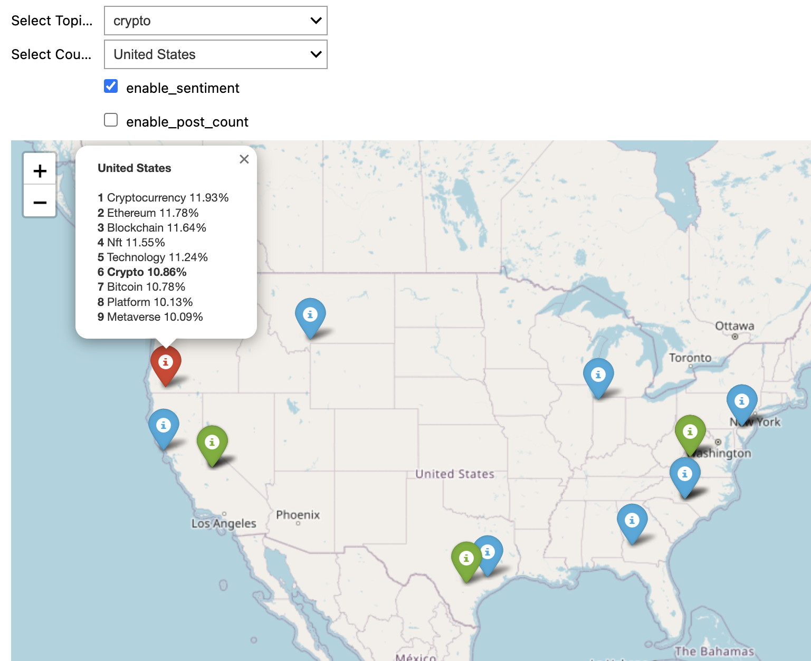

# Summary

SIRITVIS is a powerful tool designed to analyze text data from Reddit, Instagram, and other sources. It uses advanced techniques to clean data and identify main topics efficiently. The tool also includes features for visualizing data, making it easier to explore and understand the text.

One unique feature of SIRITVIS is its ability to map social media posts worldwide. This means it can show where people are talking about certain topics globally, helping to understand trends and conversations happening around the world. It also analyzes the mood or sentiment of these posts using a tool called VADER [@Hutto_Gilbert_2014].

SIRITVIS is very useful for researchers who want to study public discussions on social media. It is especially helpful for analyzing current events and global issues. The tool is easy to install using pip, a package manager. You can find detailed installation instructions on its GitHub page^[https://github.com/CodeEagle22/SIRITVIS/].

## Statement of Need
Social media platforms like Reddit and Instagram have revolutionized the way we communicate, share information, and express our opinions. They are key places for public discussions, and by analyzing text data from these platforms, we can gain insights into what people are talking about, their feelings, and current trends. This information is valuable for fields like marketing, politics, and disaster response.

However, dealing with the large and constantly changing amount of text data from social media is challenging. To help with this, we have developed SIRITVIS, an open-source tool for analyzing social media text. SIRITVIS uses advanced topic modeling techniques to automatically identify and extract key topics from large text datasets, making it easier to explore and find meaningful patterns.

SIRITVIS supports several advanced topic models such as AVITM [@srivastava2017autoencoding], Latent Dirichlet Allocation (LDA) [@blei2003latent], Neural Latent Dirichlet Allocation (NeuralLDA) [@srivastava2017autoencoding], Product Latent Dirichlet Allocation (ProdLDA) [@srivastava2017autoencoding], and Contextualized Topic Models (CTM) [@bianchi-etal-2021-cross]. These models help in discovering key topics without prior knowledge of the data, making it easier to analyze and understand large collections of text.

SIRITVIS is designed to simplify the process of analyzing social media text data, making it accessible for various applications.

SIRITVIS can extract and analyze data from platforms like Reddit and Instagram using their APIs (tools for accessing data). The software simplifies data extraction and then processes the raw data using advanced natural language processing (NLP) techniques to clean and prepare it for analysis. Users can adjust settings to fit their specific needs and expertise.

The package includes tools for evaluating the performance of trained models using various customizable metrics, ensuring users can assess the quality of their analysis. Additionally, SIRITVIS helps users identify and use the best models for their data analysis tasks.

To make understanding the data easier, SIRITVIS includes two powerful visualization tools: PyLDAvis and Word Cloud. PyLDAvis [@sievert-shirley-2014-ldavis] creates dynamic and interactive visualizations of topic models, helping users explore and understand the relationships between topics and their keywords (see Figure 1). The Word Cloud tool [@Mueller_Wordcloud_2023] visually displays the most frequently used words in a dataset, making it simple to spot key terms and patterns at a glance (see Figure 2). These tools provide a user-friendly way to uncover and communicate the insights hidden in text data.

SIRITVIS is particularly known for its ability to map the locations of Instagram posts and Reddit comments globally, showing the most popular topics in each area and their frequencies (see Figure 3). It also uses color-coding to show the sentiments (positive, negative, or neutral) of posts at each location (see Figure 4). Additionally, SIRITVIS allows users to explore specific keywords and see where they appear on the world map. This spatial information is very useful for understanding public discussions and supporting data-driven decision-making in various fields.
## Comparing and Contrasting Available Toolsets

In recent years, understanding what people say on social media has gotten better. One new way to do this is called SIRITVIS. It's different from other tools like TTLocVis [@Kant2020], TweetViz [@stojanovski2014], and Twitmo [@abuchmueller].

SIRITVIS helps people look at social media posts in an easy way. It can understand lots of different topics and even figure out where the posts are coming from on a map. Plus, it works well with another tool called pyLDAvis, which helps show the results in a nice way.

One cool thing about SIRITVIS is that it has a bunch of ways to check if the results are good. These include things like checking if the topics are different enough from each other and if they make sense. This helps make sure the results are trustworthy.

SIRITVIS also comes with a tool called octis [@terragni-etal-2021-octis], which helps measure how good the results are. It looks at things like if the topics are diverse, accurate, and if they make sense. This extra tool adds to SIRITVIS's reliability, ensuring that the results it gives are meaningful and useful.

SIRITVIS is made to be easy to use. It has a simple design and instructions that anyone can follow, whether they're new or experienced. And it can work with different types of data, so people can use it however they need to. This makes it useful for lots of different people who want to understand social media better.

# Figures

# Acknowledgements

We wish to formally acknowledge and express our gratitude for the substantial contributions of Christoph Weisser and Michael Schlee throughout the entire duration of this project.

# References

