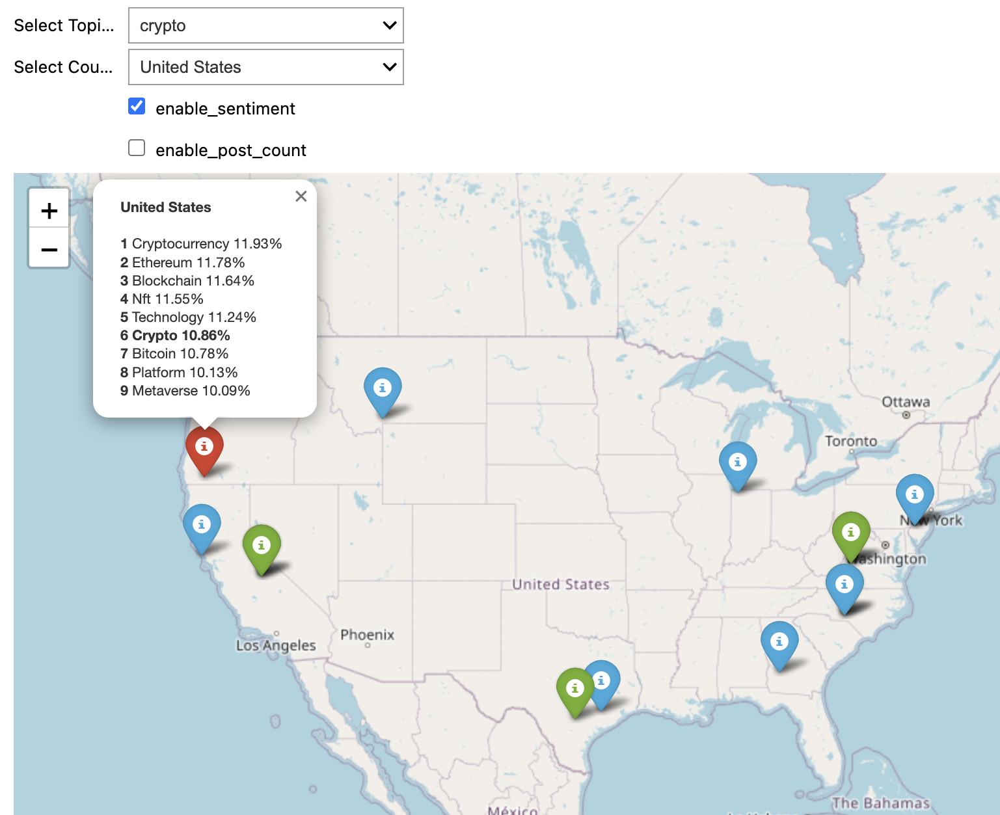

# Summary

**SIRITVIS** is a comprehensive text analysis tool developed to analyze data from Reddit, Instagram, and various external text data sources. It utilizes advanced methodologies to extract information, clean data, and optimize topic modeling efficiently. The package includes data visualization tools that assist in exploring and understanding textual data. A notable feature of SIRITVIS is its ability to map social media posts globally, correlating geographical locations with trending topics, thus providing insights into global trends and digital conversations. It also performs sentiment analysis on mapped data using the VADER tool [@Hutto_Gilbert_2014]. This software is a valuable resource for the scientific community, enabling the exploration of public discussions across multiple social platforms. It supports a range of research purposes, including the analysis of current discussions on global geopolitical issues. The installation of SIRITVIS is straightforward and facilitated by the pip package manager. Detailed installation instructions are available in the package's repository^[https://github.com/CodeEagle22/SIRITVIS/].

## Statement of Need

The proliferation of social media platforms has significantly changed how we communicate, share information, and express opinions on a variety of topics. Platforms like Reddit and Instagram serve as major hubs for public discussion. Analyzing text data from these platforms can provide insights into public sentiments, preferences, and trending discussions, which are valuable for areas such as marketing, politics, and disaster management.

Handling the large volume of unstructured text data from social media can be challenging due to its dynamic and expansive nature. To help with this, we present **SIRITVIS**, an open-source text analysis package designed to facilitate the exploration and analysis of social media data. SIRITVIS incorporates several advanced neural topic models, including AVITM [@srivastava2017autoencoding], as well as other widely used models like Latent Dirichlet Allocation (LDA) [@blei2003latent], Neural Latent Dirichlet Allocation (NeuralLDA) [@srivastava2017autoencoding], Product Latent Dirichlet Allocation (ProdLDA) [@srivastava2017autoencoding], and Contextualized Topic Models (CTM) [@bianchi-etal-2021-cross]. These models help in automatically identifying and extracting key topics in an unsupervised manner, allowing users to efficiently explore large text datasets and uncover meaningful patterns.

SIRITVIS aims to provide users with a tool that simplifies the complex task of analyzing social media text data, making it accessible and practical for a variety of applications.

SIRITVIS is an open-source toolset designed for extracting and analyzing data from social media platforms, including Reddit and Instagram, using their respective APIs. The software facilitates a seamless process of data extraction, followed by detailed preprocessing, where essential information is distilled from raw data and extraneous elements are removed through advanced natural language processing (NLP) techniques. This processed data is then used for topic modeling, with users having the option to adjust hyperparameters based on their specific needs and domain expertise.

The package also features an evaluation module that allows users to assess trained models using a variety of metrics that can be customized to fit particular analytical requirements. Additionally, SIRITVIS includes functionalities for analyzing and retrieving the most proficiently trained models, enhancing its utility for research and analysis.

To further aid in the understanding and interpretation of textual data, SIRITVIS incorporates two robust data visualization tools: PyLDAvis and Word Cloud. PyLDAvis [@sievert-shirley-2014-ldavis], enables a more accessible interpretation of topic models derived from textual data by creating dynamic and interactive visualizations that help users explore the relationships between topics and their associated keywords (see Figure 1). The Word Cloud tool [@Mueller_Wordcloud_2023], provides a simple yet effective way to visually represent the most frequently occurring words in a dataset, making it easier to identify key terms and patterns at a glance (see Figure 2). These tools collectively offer a comprehensive and intuitive approach for uncovering and communicating the hidden patterns and insights within textual data.

SIRITVIS is renowned for its remarkable ability to map the spatial distribution of Instagram posts and Reddit comments onto a global map, linking each geographical location with its top trending topics and their respective frequencies (see Figure 3). Moreover, it excels in the color-coding of these locations based on the sentiments expressed in each post, providing an accurate count of positive, negative, and neutral posts (see Figure 4). Furthermore, SIRITVIS facilitates a user-friendly exploration of specific keywords and visualizes their occurrences on the world map. This spatial insight contributes significantly to an enhanced understanding of public discussions and lends invaluable support to data-driven decision-making across diverse domains.

## Comparing and Contrasting Available Toolsets

In recent years, the field of text data analysis from social media has seen significant advancements, offering researchers a variety of tools and approaches to analyze the wealth of online content. Within this evolving landscape, the SIRITVIS framework offers a unique approach that differentiates itself from existing tools such as TTLocVis [@Kant2020], TweetViz [@stojanovski2014], and Twitmo [@abuchmueller].

SIRITVIS provides a flexible, user-friendly, and comprehensive solution for analyzing social media text data. It includes a wide range of advanced topic models and a unique capability for identifying geographical information. Additionally, SIRITVIS integrates seamlessly with pyLDAvis [@sievert-shirley-2014-ldavis], enabling users to visualize the outcomes of their analyses effectively.

A distinguishing feature of SIRITVIS is its comprehensive suite of evaluation metrics, supported by the octis tool [@terragni-etal-2021-octis]. These metrics include topic diversity, accuracy, inverted RBO, coherence, and Jaccard similarity, ensuring that the topic models generated are both reliable and meaningful. This robust evaluation framework reflects a commitment to producing substantive and high-quality results.

SIRITVIS also emphasizes ease of use and accessibility. Its intuitive interface and detailed documentation are designed to accommodate both novice and experienced users, facilitating ease of navigation and application. Moreover, SIRITVIS is compatible with various data sources and formats, allowing researchers to tailor it to their specific needs without difficulty. This focus on accessibility broadens its utility, making advanced text data analysis more accessible to a wider range of researchers and practitioners.

# Figures

# Acknowledgements

We wish to formally acknowledge and express our gratitude for the substantial contributions of Christoph Weisser and Michael Schlee throughout the entire duration of this project.

# References
